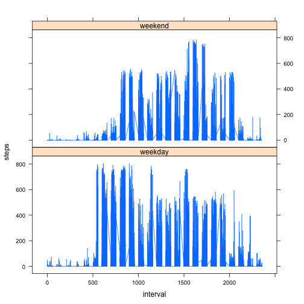

# Reproducible Research: Peer Assessment 1

by Kasim Te, updated May 2014

----

## Loading and preprocessing the data

Let's read in the data first. The data is in a compressed file named "activity.zip" included with the git repository. First unzip that file to your working directory, which will reveal a CSV format file ("activity.csv"). Then we can load and check the data as seen right below here.


```r
data <- read.csv("activity.csv")
head(data)
```

```
##   steps       date interval
## 1    NA 2012-10-01        0
## 2    NA 2012-10-01        5
## 3    NA 2012-10-01       10
## 4    NA 2012-10-01       15
## 5    NA 2012-10-01       20
## 6    NA 2012-10-01       25
```


Now let's process/transform the data into a format suitable for our analysis. In other words, let's tidy it up. 


```r
# Let's convert the date column to Date class objects.
data$date <- as.Date(data$date)
```


## What is mean total number of steps taken per day?

Here is a histogram of the total number of steps taken each day. We ignore the missing values in the dataset.


```r
# Sum the steps based on date and then run the hist function.
total <- aggregate(steps ~ date, data = data, sum)
hist(total$steps)
```

 


Calculate and report the **mean** and **median** total number of steps taken per day.


```r
mean(total$steps)
```

```
## [1] 10766
```

```r
median(total$steps)
```

```
## [1] 10765
```


## What is the average daily activity pattern?

Make a time series plot (i.e. type = "l") of the 5-minute interval (x-axis) and the average number of steps taken, averaged across all days (y-axis).


```r
# Aggregate the steps based on interval and find the average.
intervalmeans <- aggregate(steps ~ interval, data = data, mean)
plot(intervalmeans, type = "l")
```

 


Which 5-minute interval, on average across all the days in the dataset, contains the maximum number of steps? 


```r
# Let's order it by steps with decreasing set to TRUE.
ordered <- intervalmeans[order(intervalmeans$steps, decreasing = T), ]
# Then, we'll show the first row.
head(ordered, 1)
```

```
##     interval steps
## 104      835 206.2
```


## Imputing missing values

Calculate and report the total number of missing values in the dataset (i.e. the total number of rows with NAs).


```r
# Run a simple length query based on which step values are NA.
length(which(is.na(data$steps)))
```

```
## [1] 2304
```


Here, we replace NA values with the mean steps for that 5-minute interval. We create a new dataset that is equal to the original dataset but with the missing data filled in.


```r
# Merge in a column of the mean interval.
new <- merge(data, intervalmeans, by.x = "interval", by.y = "interval")
# Replace NA values with mean steps for that interval.
new$steps.x[which(is.na(new$steps.x))] <- new$steps.y[which(is.na(new$steps.x))]
# Delete the merged column.
new$steps.y <- NULL
# Clean up the column headers.
names(new) <- c("interval", "steps", "date")
```


Make a histogram of the total number of steps taken each day. 


```r
# Sum the steps based on date and then run the hist function.
newtotal <- aggregate(steps ~ date, data = new, sum)
hist(newtotal$steps)
```

 


Calculate and report the mean and median total number of steps taken per day. Do these values differ from the estimates from the first part of the assignment? What is the impact of imputing missing data on the estimates of the total daily number of steps? 


```r
# As seen here, the values do not differ significantly. The effect of adding
# in average interval values for NA values is negligible.
mean(newtotal$steps)
```

```
## [1] 10766
```

```r
median(newtotal$steps)
```

```
## [1] 10766
```


## Are there differences in activity patterns between weekdays and weekends?

Here, we create a new factor variable in the dataset with two levels – “weekday” and “weekend” indicating whether a given date is a weekday or weekend day. We use the dataset with the filled-in missing values for this part.


```r
new$day <- weekdays(new$date)
weekend <- c("Saturday", "Sunday")
new$weekday <- ifelse(new$day %in% weekend, "weekend", "weekday")
new$weekday <- as.factor(new$weekday)
```


Then, to compare activity patterns between weekdays and weekends, we make a panel plot containing a time series plot (i.e. type = "l") of the 5-minute interval (x-axis) and the average number of steps taken, averaged across all weekday days or weekend days (y-axis). 


```r
library(lattice)
xyplot(steps ~ interval | weekday, data = new, layout = c(1, 2), type = "l")
```

 

